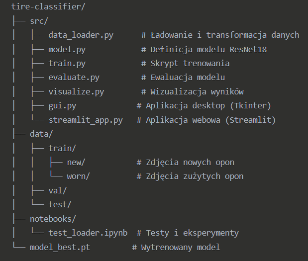
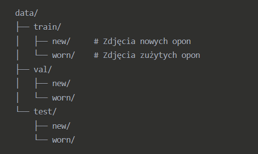
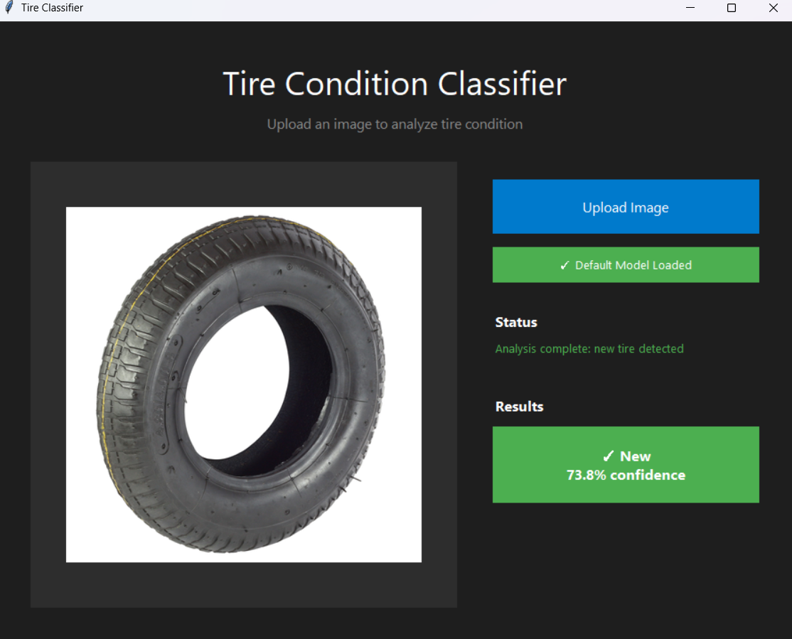
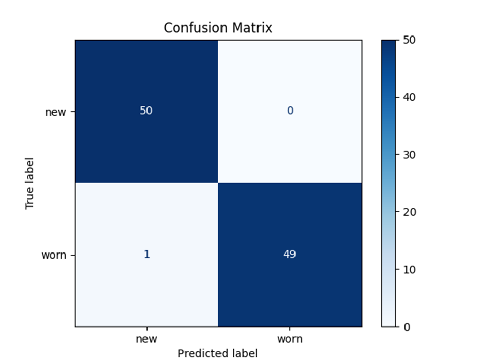
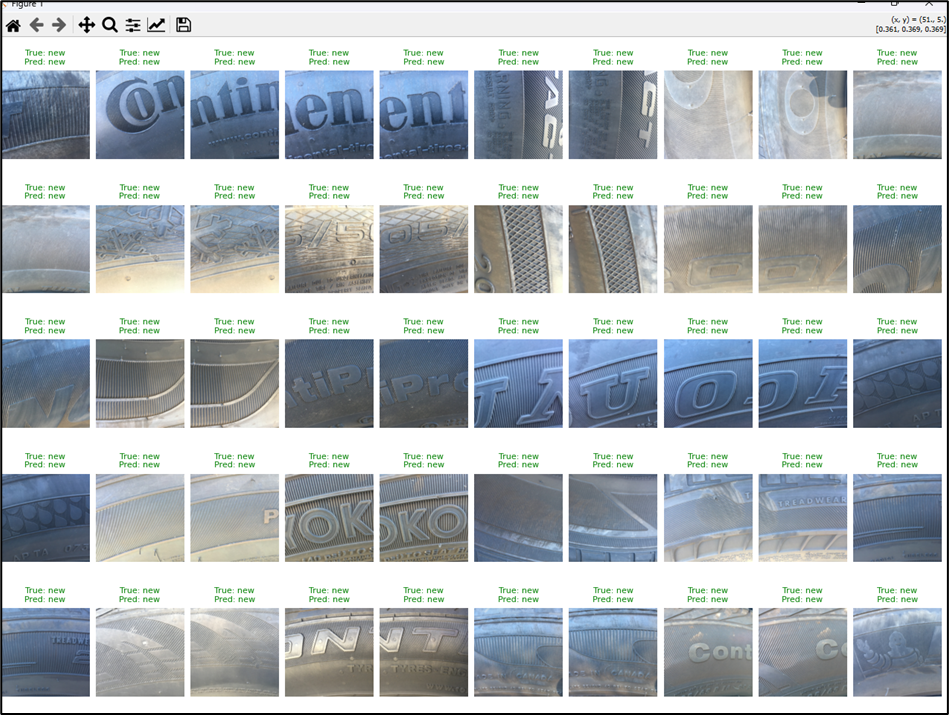

🛞 Tire Condition Classifier

Projekt wykorzystujący głębokie uczenie maszynowe do klasyfikacji stanu opon samochodowych.
System automatycznie rozpoznaje, czy opona jest nowa czy zużyta, na podstawie analizy obrazu.
📋 Opis projektu

Klasyfikator wykorzystuje sieć neuronową ResNet18 do analizy zdjęć opon i określenia ich stanu.
Model rozróżnia dwie kategorie:

    🟢 New – opony nowe / w dobrym stanie

    🔴 Worn – opony zużyte / wymagające wymiany

🎯 Funkcjonalności

✅ Trenowanie modelu – pełny pipeline treningu z walidacją
🖥️ Interfejs graficzny – intuicyjna aplikacja desktopowa z drag&drop
🌐 Streamlit Web App – aplikacja webowa (w przygotowaniu)
📊 Wizualizacja wyników – macierz pomyłek i przykładowe predykcje
⚡ Wsparcie GPU – automatyczne wykrywanie i wykorzystanie CUDA
🛠️ Technologie

    🔬 PyTorch – framework deep learning

    🖼️ torchvision – transformacje obrazów i gotowe modele

    🧰 Tkinter – interfejs graficzny desktop

    🌐 Streamlit – aplikacja webowa

    🖌️ Pillow (PIL) – przetwarzanie obrazów

    📈 matplotlib, seaborn – wizualizacja danych

    📊 scikit-learn – metryki ewaluacji

📁 Struktura projektu

🚀 Instalacja
1️⃣ Klonowanie repozytorium
git clone https://github.com/your-username/tire-classifier.git
cd tire-classifier

2️⃣ Utworzenie środowiska wirtualnego
bashpython -m venv venv
source venv/bin/activate  # Linux/Mac
venv\Scripts\activate     # Windows

3️⃣ Instalacja zależności
pip install torch torchvision
pip install pillow matplotlib seaborn scikit-learn
pip install streamlit tqdm

📊 Przygotowanie danych
Organizuj dane w następującej strukturze:

📷 Wymagania dla zdjęć:
- Format: JPG, PNG, BMP
- Zalecana rozdzielczość: min. 224x224px
- Dobrze oświetlone zdjęcia opon
- Różnorodne kąty i perspektywy

🔧 Użycie
🎓Trenowanie modelu:
cd src
python train.py

🖥️GUI
cd src
python gui.py

📊Wizualizacja wyników
cd src
python visualize.py
Generuje:

🟦 Macierz pomyłek (confusion matrix)

🟩🟥 Przykładowe predykcje z oznaczeniem (zielony = poprawne, czerwony = błędne)

📈 Wyniki
Model osiąga następujące metryki na zbiorze testowym:
- Accuracy: ~XX%
- Precision: ~XX%
- Recall: ~XX%
- F1-Score: ~XX%

⚙️ Konfiguracja
Parametry modelu:
- Architektura: ResNet18 (pre-trained na ImageNet)
- Input size: 224x224x3
- Output classes: 2 (new, worn)
- Optimizer: Adam
- Loss function: CrossEntropyLoss

Augmentacja danych:
- Random horizontal flip
- Random rotation (±10°)
- Normalizacja: mean=[0.5, 0.5, 0.5], std=[0.5, 0.5, 0.5]

🐛 Rozwiązywanie problemów:
⚡Problem z CUDA
- bash# Sprawdź dostępność CUDA
- python -c "import torch; print(torch.cuda.is_available())"

💾Problem z ładowaniem modelu
- Upewnij się, że plik model_best.pt istnieje
- Sprawdź zgodność architektury modelu
- Użyj map_location='cpu' dla CPU-only

🗃️Problem z danymi
- Sprawdź strukturę folderów
- Upewnij się, że obrazy są w obsługiwanych formatach
- Zweryfikuj ścieżki w kodzie